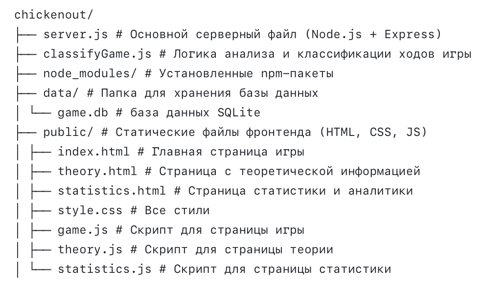

# Chicken Out

Chicken Out — браузерная обучающая игра, моделирующая классическую дилемму "Chicken" из теории игр с интерактивной настройкой матрицы выигрыша и адаптивным ботом.

[Ссылка на игру](http://95.163.221.29:3000)

---

## Описание проекта

Игра демонстрирует взаимодействие двух игроков (человек и бот), каждый из которых выбирает стратегию "газ" (рисковать) или "тормоз" (уступить).  
Пользователь может изменять матрицу выигрышей, влияя на поведение и стратегию игроков.

Бот принимает решения на основе текущего доверия к игроку, вычисляет равновесие по Нэшу и адаптирует стиль игры (рискофоб/рискофил), что делает его поведение реалистичным и интересным.

## Работа бота

### 1. Исходные параметры
- B_belief — доверие бота к игроку (от 30 до 70 в начале).
- botPersonality — личность бота: 'riskSeeking' — рискофил,'riskAverse' — рискофоб.
- recentCrashes — счетчик столкновений за последние 5 раундов.
- actionHistory — история ходов игрока (выборы «газ» или «тормоз»).
- personalityShift — дополнительный сдвиг, зависящий от личности и текущих очков.
  
### 2. Логика расчёта личности и сдвига
Если бот — рискофил, personalityShift = +0.4, если осторожный — -0.4.
Если бот отстает по очкам (pointsB < pointsA), добавляется +0.3 (бот идет на риск, чтобы догнать).
Если бот впереди (pointsB > pointsA), уменьшает риск на 0.2 (играет осторожнее).

### 3. Основное решение бота (функция calculateBotAction)
- Получает текущую матрицу выигрышей из интерфейса (значения очков за каждую комбинацию действий).
- Вычисляет равновесие Нэша по формуле (вероятность «газ» для бота).
- Учитывает личностный сдвиг (personalitySign).
- Учитывает текущую разницу в очках (personalityShift).
- Учитывает уровень доверия B_belief (чем выше доверие, тем агрессивнее бот).
- Учитывает частоту «газа» игрока за последние 5 ходов (если игрок часто давит «газ», осторожный бот уменьшит риск, рискофил — наоборот).
- Учитывает число недавних столкновений (чем больше, тем осторожнее бот).
- Затем складывает все эти факторы с весами и пропускает через сигмоидальную функцию — получается вероятность того, что бот выберет «газ». По ней бот выбирает своё действие случайно.

### 4. Обновление доверия
- Если оба тормозят — доверие +10.
- Если игрок тормозит, бот газует — доверие +15.
- Если игрок газует, бот тормозит — доверие -15.
- Если оба газуют — доверие -25.
- Доверие ограничено от 0 до 100.
  
### 5. Память о последних столкновениях
- При столкновении (газ у обоих) увеличивается счётчик recentCrashes.
- Если нет столкновения — recentCrashes уменьшается, но не ниже 0.
- Максимальная память recentCrashes — 5 раундов.

### 6. История действий игрока
- Хранится в actionHistory до 20 ходов.
- Используется для подсчёта частоты «газа» игрока и обновления доверия.

### 7. Дополнительные моменты
- При старте раунда обе машины начинают движение.
- Таймер 5 секунд даёт игроку время сделать выбор.
- Если игрок не выбрал действие — автоматически выбирается «газ».
- После выбора действий обоих, происходит расчет очков и обновление состояния.
- Данные раунда отправляются на сервер.

---

## Функциональность

- Настройка матрицы выплат пользователем  
- Анимация ходов и стратегий с разбивкой по секундам  
- Динамическое изменение доверия между игроками  
- Расчёт равновесия по Нэшу для выбора стратегии бота  
- Профили поведения бота (рискофоб/рискофил)  
- Хранение истории игр и статистика на сервере  
- Страница с краткой теорией игры и экономической модели  
- Отображение статистики сыгранных партий

---

## Структура проекта

---

## Запуск

<pre> <code>node server.js</code> </pre>

